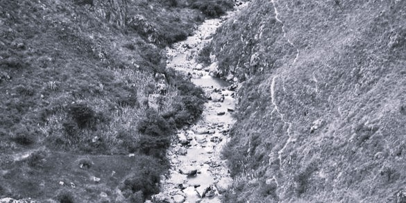
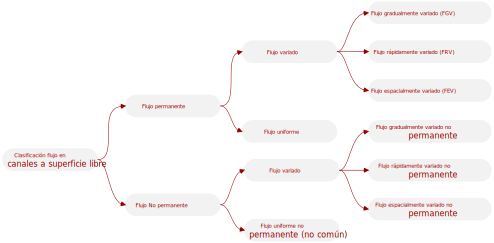

## Clasificación del flujo  

Keywords: `Hydraulics` `Open channel flow` `Uniform flow` `FGV` `FEV`

> Rio Moyán en Lambayeque, Peru. Adaptado de Fig.10-18 [^1].

En la dinámica de los fluidos existen diferentes clasificaciones del flujo en función de sus variables y características. En el caso de los canales a superficie libre, generalmente la clasificación se realiza de acuerdo con el cambio en la profundidad de flujo con respecto al tiempo y el espacio, como se muestra en el siguiente diagrama. 

 
Clasificación de flujo según la variación de la profundidad de flujo en el tiempo y espacio. 

 

### En función del tiempo. Flujo permanente y no permanente.

Se dice que un flujo es **permanente** si la profundidad del flujo no varía con el tiempo en cualquier lugar o sección dado a lo largo del canal (aunque este podría variar de un lugar a otro). De otra manera, es **no permanente**. En este sentido, si el flujo es permanente, la velocidad media en cualquier sección se mantendrá constante en el tiempo y consecuentemente el caudal es constante y continuo.

 
La gráfica muestra la diferencia entre el flujo permanente y el no permanente, representando la variación del caudal en función del tiempo.   

### En función de espacio. Flujo uniforme y variado.

El flujo en canales a superficie libre también se clasifica como uniforme o variado, esto depende de cómo la profundidad del flujo _(y)_ y la profundidad de flujo de la sección _(d)_, varía a lo largo del canal. Se dice que el flujo en un canal es **uniforme** si la profundidad del flujo _(y)_ y la velocidad media se mantiene constante. De otra manera, el flujo es no uniforme o variado, lo cual indica que la profundidad varía con la distancia en la dirección del flujo. 

Las condiciones del flujo uniforme comúnmente se encuentran en la práctica en tramos largos y rectos de canales con pendiente y sección transversal constantes. En canales abiertos de pendiente y sección transversal constantes, el líquido acelera hasta que la pérdida de carga debida a los efectos de fricción se iguala a la caída de elevación. El líquido en este punto alcanza su velocidad final y se establece un flujo uniforme. El flujo se mantiene uniforme siempre que la pendiente, la sección transversal y la rugosidad del canal no tengan algún cambio. 

La presencia de un obstáculo o un cambio de la pendiente o de sección transversal, ocasiona que la profundidad del flujo cambie y en consecuencia el flujo se convierta en **variado** o no uniforme. Estos flujos variados son comunes en canales naturales o artificiales como ríos, sistemas de irrigación y canales de desagüe. Dentro del flujo variado tenemos el **flujo de rápidamente variado (FRV)** o de variación rápida, si la profundidad del flujo cambia considerablemente sobre una distancia relativamente corta en la dirección del flujo, como el paso del flujo de agua a través de una compuerta parcialmente abierta o la presencia de un resalto hidráulico. Por otro lado, tenemos el **flujo gradualmente variado (FGV)** o de variación gradual, cuando la profundidad del flujo cambia gradualmente en una distancia larga a lo extenso del canal. Ahora, cuando a lo largo del canal, una parte del caudal entra o sale del sistema, se presenta un flujo conocido como **flujo espacialmente variado (FEV)** o discontinuo.

En FGV se puede trabajar con la velocidad media unidimensional, tal y como se trabaja con ella en flujos uniformes. Sin embargo, la velocidad promedio no siempre es la más útil o el parámetro más apropiado para FRV. Por lo tanto, el análisis de flujos de variación rápida es bastante complicado, en especial cuando el flujo es no permanente.

 
Convenciones del esquema: Flujo uniforme (FU, UF por sus siglas en inglés), flujo gradualmente variado (FGV, GVF por sus siglas en inglés) 
y flujo rápidamente variado (FRV, RVF por sus siglas en inglés) en un canal abierto. [^2]  

### Regimen del flujo 

El regimen o comportamiento del flujo en sistemas a superficie libre, está gobernado por los efectos de viscosidad y gravedad en relación con las fuerzas inerciales del flujo.

#### Efecto de viscosidad. Flujo laminar y turbulento.

El estado o comportamiento del flujo en canales a superficie libre está gobernado básicamente por los efectos de viscosidad y gravedad en relación con las fuerzas inerciales del flujo. El flujo se puede clasificar el flujo en laminar, turbulento o transicional, según el efecto de la viscosidad en relación con la inercia. El flujo es **laminar** si las fuerzas viscosas son muy fuertes en relación con las fuerzas inerciales, de tal manera que la viscosidad es relevante en el comportamiento del flujo. El flujo es turbulento si las fuerzas viscosas son débiles en relación con las fuerzas inerciales. Entre los estados de flujo laminar y turbulento existe un estado mixto o transicional. La clasificación del flujo o el efecto de la viscosidad en relación con la inercia se representa mediante el número de Reynolds, definido por la siguiente ecuación:

 
Donde, <b>V</b> es la velocidad media de flujo, 
<b>L</b> es la longitud característica (considerada como radio hidráulico, R) 
y <b><i>v</i></b> la viscosidad cinemática del fluido .  

Si se considera que con frecuencia los canales a superficie libre tienen secciones transversales irregulares, el radio hidráulico **R** sirve como la longitud característica y da uniformidad al tratamiento de canales. También, el número de Reynolds es constante para toda la sección del flujo uniforme de un canal. El flujo en canales es laminar si el número de Reynolds (Re) es pequeño y turbulento si es grande. Experimentalmente, se han definido los siguientes rangos para la clasificación del flujo.

| Número de Reynolds | Tipo de flujo |
|:------------------:|:-------------:|
|       ≤ 500        |    Laminar    |
|  entre 500 y 2500  |  Transición   |
|       ≥ 2500       |  Turbulento   |

El flujo laminar en canales a superficie libre ocurre con muy poca frecuencia, ya que la mayoría de los canales transportan el líquido en condiciones de flujo turbulento. Sin embargo, se puede encontrar flujo laminar cuando una delgada capa de agua (como el agua que fluye por cunetas de carreteras o estacionamientos) se mueve a baja velocidad.

#### Efecto de gravedad. Flujo crítico, subcrítico y supercrítico.

El efecto de la gravedad sobre el estado de flujo se presenta por la relación entre las fuerzas inerciales y las fuerzas gravitacionales. Esta relación está dada por el **_número de Froude_**, definido como

 
Donde, <b>V</b> es la velocidad media de flujo, 
<b>L</b> es la longitud característica (considerada como la profundidad hidráulica, D) 
y <b><i>g</i></b> es la aceleración gravitacional.  

El número de Froude es un parámetro importante que gobierna el tipo del flujo en canales a superficie libre y se clasifica como:

| Número de Froude | Tipo de flujo |
|:----------------:|:-------------:|
|       > 1        |  Subcrítico   |
|        1         |    Crítico    |
|       > 1        | Supercrítico  |

El denominador del número de Froude es un parámetro adimensional, es decir que su denominador tiene la dimensión de la velocidad, y este representa la velocidad o celeridad de la onda **co**. Por consiguiente, a velocidades de flujo lentas `Fr < 1`, una pequeña alteración viaja corriente arriba _(con una velocidad co - V relativa al observador en reposo)_ y afecta las condiciones de flujo corriente arriba. Este se llama flujo tranquilo o **subcrítico** e indica que eñ flujo es dominado por las fuerzas de gravedad. Pero, a velocidades de flujo altas `Fr > 1`, una pequeña alteración no puede viajar corriente arriba _(la onda es llevada corriente abajo con una velocidad V - co relativa)_ así que las condiciones de flujo corriente arriba no pueden ser influidas por las condiciones de flujo corriente abajo. Este se llama flujo rápido o **supercrítico**, cuando las fuerzas de inercia dominan el flujo y es controlado por las condiciones aguas arriba. [^2]

___
### Preguntas
1. ¿Cuáles son los regímenes de flujo en sistemas a superficie libre?
2. Con base en la clasificación de flujo en función del espacio, identifique los tipos de flujo que se presentan en la siguiente figura.

 

3. Determine el regimen de flujo de un líquido que es transportado por un canal trapezoidal a razón de 350 litros por segundo, considerando que la base (b) del canal es de 5 metros, la profundidad de flujo es de 2.5 metros y la inclinación de los taludes (1:z) es de 1:2. 

___

### Referencias
- The Hydraulics of Channel Flow: An Introduction. Chanson H. 2nd Ed.,Elsevier Butterworth-Heinemann. 2004.
- Open Channel Hydraulics. Chow, Ven Te. 2nd Ed., Blackburn Press. 2009.
- Open Channel Flow. Chaudry, M. H. 2ed., Springer, 2008.
- Open Channel Flow. Osman Akan, A. Elsevier Ltd., 2006.
- Introducción a la hidráulica de canales. Duarte A. Carlos A. 4a Ed., Editorial Universidad Nacional de Colombia. 2016.
- Flow in open channels. Subramanya K. 3th Ed., Tata McGraw-Hill Publishing. 2009.

### Control de versiones

| Versión | Descripción                                                    |                    Autor                    | Horas |
|:-------:|:---------------------------------------------------------------|:-------------------------------------------:|:-----:|
| 2023.06 | Versión inicial, definición de estructura general y contenido. | [juanrodace](https://github.com/juanrodace) |  1.0  |
| 2023.06 | Inclusión de conceptos y esquemas.                             | [juanrodace](https://github.com/juanrodace) |  1.5  |

| [:arrow_backward:Anterior](Definiciones.md) | [:house: Inicio](../../Readme.md) | [:beginner: Ayuda](https://github.com/juanrodace/J.HSLB/discussions) | [Siguiente:arrow_forward:](Velocidades.md) |
|---------------------------------------------|-----------------------------------|----------------------------------------------------------------------|--------------------------------------------|

_J.HSLB es de uso libre para fines académicos, conoce nuestra licencia, cláusulas, condiciones de uso y como referenciar los contenidos publicados en este repositorio, dando [clic aquí](../../License.md)._

_¡Encontraste útil este repositorio!, apoya su difusión marcando este repositorio con una ⭐ o síguenos dando clic en el botón Follow de [juanrodace](https://github.com/juanrodace) en GitHub._

[^1]: Fundamentos de Hidráulica de Canales. Ponce, Victor M. 2015.
[^2]: Fluid mechanics. Fundamentals and Applications.. Cengel Y., Cimbala J. McGraw-Hill.2006.