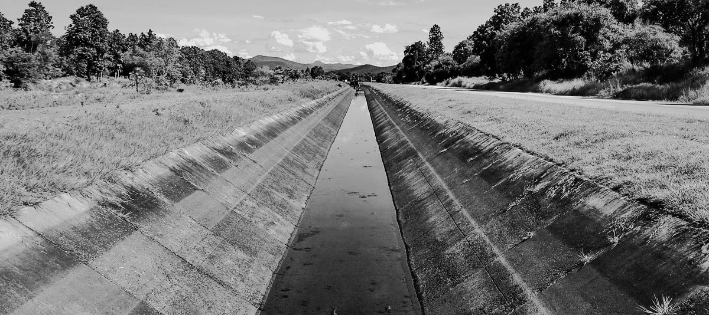

## Definiciones básicas

Keywords: `Hydraulics` `Channel` `Open channel flow`

> En la ilustración, canal de riego recubierto. Foto de Armenta Humberto.

 ### Transporte de fluidos

El transporte de fluidos incompresibles o líquidos suele darse de dos formas diferentes, en condiciones de presión y a superficie libre. Los primeros se caracterizan por transportar el fluido a través de conductos cerrados completamente llenos y sometidos a una presión hidráulica. Los segundos, transportan el líquido en secciones transversales abiertas o cerradas con la característica de formar una superficie libre sometida o expuesta a la presión atmosférica. 

En el siguiente esquema se presenta la comparación de las dos formas de flujo desde el punto de vista de la energía, en el cual se puede apreciar la diferencia en las líneas de energía y en las de gradiente hidráulico (piezométrica). Así mismo, a continuación se presenta una tabla comparativa que permite contrastar algunas características de las dos clases de flujo.

| Característica                                  | Flujo en tuberías a presión                                  | Flujo en conductos a superficie libre                                                                                   |
|-------------------------------------------------|--------------------------------------------------------------|-------------------------------------------------------------------------------------------------------------------------|
| Fuerza generadora del flujo.                    | Fuerzas de presión.                                          | Fuerza gravitacional.                                                                                                   | 
| Presión en la sección transversal               | Hidráulica y uniforme.                                       | Variable y en su mayoría hidróstatica.                                                                                  |
| Linea de gradiente hidráulico.                  | Formada por la altura del conducto y la altura piezométrica. | Formada por la altura del fondo (solera) y la profundidad de la lámina de agua.                                         | 
| Perfil de velocidades.                          | Parabólico.                                                  | Parabólico.                                                                                                             | 
| Velocidad máxima.                               | En el centro del conducto.                                   | Cerca a la superficie libre dentro del 25% de su profundidad.                                                           | 
| Longitud característica.                        | Diámetro.                                                    | Radio hidráulico.                                                                                                       | 
| Clasificación del flujo en función del tiempo.  | Flujo permanente y no permanente.                            | Flujo permanente y no permanente.                                                                                       | 
| Clasificación del flujo en función del espacio. | Flujo uniforme y no uniforme.                                | Flujo uniforme, flujo gradualmente variado (FGV), flujo rápidamente variado (FRV) y flujo espacialmente variado (FEV) . |
| Efecto de la viscosidad. Clasificación.         | Flujo laminar, en transición y turbulento.                   | Flujo turbulento en su mayoría con algunas excepciones.                                                                 | 
| Efecto de la gravedad. Clasificación.           | No aplica.                                                   | Flujo crítico, subcrítico y supercrítico.                                                                              | 

<i>Comparación entre flujo en sistemas a presión y flujo a superficie libre.</i> 

 

___

### Referencias
- The Hydraulics of Channel Flow: An Introduction. Chanson H. 2nd Ed.,Elsevier Butterworth-Heinemann. 2004.
- Open Channel Hydraulics. Chow, Ven Te. 2nd Ed., Blackburn Press. 2009.
- Introducción a la hidraulica de canales. Duarte A. Carlos A. 4a Ed., Editorial Universidad Nacional de Colombia. 2016.
- Flow in open channels. Subramanya K. 3th Ed., Tata McGraw-Hill Publishing. 2009.
- Fluid mechanics. Fundamentals and Applications.. Cengel Y., Cimbala J. McGraw-Hill.2006.

### Control de versiones

| Versión | Descripción                                                        |                    Autor                    | Horas |
|:-------:|--------------------------------------------------------------------|:-------------------------------------------:|:-----:|
| 2023.06 | Versión inicial, definición de estructura general y contenido. | [juanrodace](https://github.com/juanrodace) |  1.0  |
| 2022.06 | Inclusión de conceptos.                                            | [juanrodace](https://github.com/juanrodace) |  1.0  |

| [:arrow_backward:Anterior](../Readme.md) | [:house: Inicio](../../Readme.md) | [:beginner: Ayuda](https://github.com/juanrodace/J.HSLB/discussions) | [Siguiente:arrow_forward:](../Clasificacion.md) |
|---------------------------------------------|-----------------------------------|------------------------------------------------------------------------|-------------------------------------------------|

_J.HSLB es de uso libre para fines académicos, conoce nuestra licencia, cláusulas, condiciones de uso y como referenciar los contenidos publicados en este repositorio, dando [clic aquí](../../License.md)._

_¡Encontraste útil este repositorio!, apoya su difusión marcando este repositorio con una ⭐ o síguenos dando clic en el botón Follow de [juanrodace](https://github.com/juanrodace) en GitHub._
