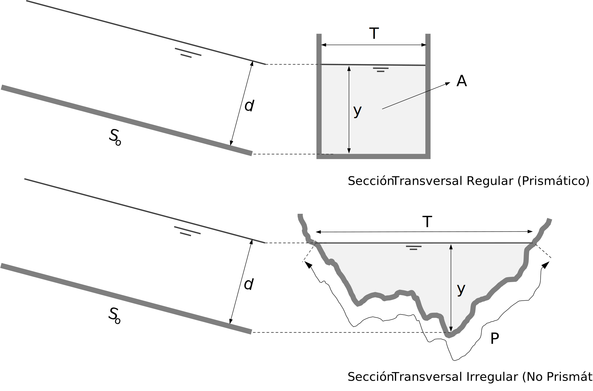

## Definiciones básicas

Keywords: `Hydraulics` `Channel` `Open channel flow`

> En la ilustración, canal de riego recubierto. Foto de Armenta Humberto.

 ### Transporte de fluidos

El transporte de fluidos incompresibles o líquidos suele darse de dos formas diferentes, en condiciones de presión y a superficie libre. Los primeros se caracterizan por transportar el fluido a través de conductos cerrados completamente llenos y sometidos a una presión hidráulica. Los segundos, transportan el líquido en secciones transversales abiertas o cerradas con la característica de formar una superficie libre sometida o expuesta a la presión atmosférica. 

En el siguiente esquema se presenta la comparación de las dos formas de flujo desde el punto de vista de la energía, en el cual se puede apreciar la diferencia en las líneas de energía y en las de gradiente hidráulico (piezométrica). Así mismo, a continuación se presenta una tabla comparativa que permite contrastar algunas características de las dos clases de flujo.

 

 Esquema de comparación entre flujo en conductos a presión y flujo a superficie libre.
  

| Característica                                  | Flujo en sistemas a presión                                  | Flujo a superficie libre                                                                                                |
|-------------------------------------------------|--------------------------------------------------------------|-------------------------------------------------------------------------------------------------------------------------|
| Fuerza generadora del flujo.                    | Fuerzas de presión.                                          | Fuerza gravitacional.                                                                                                   | 
| Presión en la sección transversal               | Hidráulica y uniforme.                                       | Variable y en su mayoría hidrostática.                                                                                  |
| Linea de gradiente hidráulico.                  | Formada por la altura del conducto y la altura piezométrica. | Formada por la altura del fondo (solera) y la profundidad de la lámina de agua.                                         | 
| Perfil de velocidades.                          | Parabólico.                                                  | Parabólico.                                                                                                             | 
| Velocidad máxima.                               | En el centro del conducto.                                   | Cerca a la superficie libre dentro del 25% de su profundidad.                                                           | 
| Longitud característica.                        | Diámetro.                                                    | Radio hidráulico.                                                                                                       | 
| Geometría.                                      | Circular, en su gran mayoría.                                | Cualquiera, regular e irregular.                                                                                        | 
| Clasificación del flujo en función del tiempo.  | Flujo permanente y no permanente.                            | Flujo permanente y no permanente.                                                                                       | 
| Clasificación del flujo en función del espacio. | Flujo uniforme y no uniforme.                                | Flujo uniforme, flujo gradualmente variado (FGV), flujo rápidamente variado (FRV) y flujo espacialmente variado (FEV) . |
| Efecto de la viscosidad. Clasificación.         | Flujo laminar, en transición y turbulento.                   | Flujo turbulento en su mayoría con algunas excepciones.                                                                 | 
| Efecto de la gravedad. Clasificación.           | No aplica.                                                   | Flujo crítico, subcrítico y supercrítico.                                                                               | 

> Comparación entre flujo en sistemas a presión y flujo a superficie libre. _Tomado de Fig.1.19_ [^1]

### Características de la sección transversal

El flujo a superficie libre o en "canales abiertos" puede darse en sistemas **naturales** o **artificiales**. Desde el punto de vista geométrico, el flujo se puede presentar en secciones transversales abiertas (como el caso de los rios, quebradas, zanjas y canales artificiales), o en secciones transversales cerradas (como tuberías de drenaje, sistemas de alcantarillado, túneles y estructuras de paso (culverts)).

 

 Esquema de flujo a superficie libre en secciones transversales abiertas y cerradas.
  

Así mismo, un canal que tiene la misma sección transversal y la misma pendiente de fondo se denomina canal **prismático**, mientras que un canal que tiene una sección transversal y/o pendiente variable se denomina canal **no prismático**. Un canal largo puede estar compuesto por varios canales regulares. Una sección transversal normal a la dirección del flujo se denomina sección del canal. Las secciones de canales naturales son, por lo general, muy irregulares y pueden constar de una sección principal y una o más secciones laterales. Los canales o conductos artificiales suelen ser diseñados con secciones de figuras geométricas regulares, más comúnmente trapezoidales, cuadrados, triangulares o circulares para el caso de secciones cerradas.

Ahorra bien, todos los sistemas a superficie libre, comparten un conjunto de características o elementos geométricos que se deben considerar desde el punto de vista hidráulico. Los elementos geométricos son propiedades de una sección de canal que pueden ser definidos por completo por la geometría de la sección y la profundidad de flujo. A continuación se presentan y definen estas características geométricas básicas de las secciones transversales.

 

 Esquema representativo de algunas de las características geométricas de los sistemas a superficie libre transversales abiertas y cerradas.
  

* **Pendiente del fondo o lecho (So)**: representa la variación de la altura del fondo del canal con respecto la longitud del mismo. Podría relacionarse con el ángulo de inclinación del canal.
* **Profundidad de flujo (y)**: distancia vertical desde el punto más bajo de la sección transversal del canal hasta la superficie libre.
* **Profundidad de flujo de la sección (d)**: es la profundidad de flujo normal o perpendicular a la dirección del flujo
* **Ancho superficial (T)**: es el ancho de la sección del canal en la superficie libre.
* **Área hidráulica o de flujo (A)**: es el área de la sección transversal del canal normal a la dirección del flujo.
* **Perímetro hidráulico o mojado (Pm)**: se define como la longitud de la línea de intersección de la superficie mojada del canal con un plano transversal perpendicular a la dirección del flujo.
* **Radio hidráulico (Rh)**: es la relación del área (A) y el perímetro mojado (Pm).
* **Profundidad hidráulica (D)**: es la relación entre el área mojada (A) y el ancho superficial (T).
* **Factor de sección para flujo crítico (Zc)**: se definen como el producto del área (A) y la raíz cuadrada de la profundidad hidráulica (D).
* **Factor de transporte para flujo uniforme (Uc)**: se define como el producto del área (A) y el radio hidráulico (R) elevado a la potencia 2/3.

Para secciones de canal regulares y simples, los elementos geométricos pueden expresarse matemáticamente en términos de la profundidad de flujo y de otras dimensiones de la sección. Para el caso de secciones complicadas y secciones naturales (irregulares), no se puede escribir una expresión algebraica simple, pero pueden prepararse curvas que representen la relación entre estos elementos y la profundidad de flujo.
___

### Referencias
- The Hydraulics of Channel Flow: An Introduction. Chanson H. 2nd Ed.,Elsevier Butterworth-Heinemann. 2004.
- Open Channel Hydraulics. Chow, Ven Te. 2nd Ed., Blackburn Press. 2009.
- Introducción a la hidráulica de canales. Duarte A. Carlos A. 4a Ed., Editorial Universidad Nacional de Colombia. 2016.
- Flow in open channels. Subramanya K. 3th Ed., Tata McGraw-Hill Publishing. 2009.
- Fluid mechanics. Fundamentals and Applications.. Cengel Y., Cimbala J. McGraw-Hill.2006.

### Control de versiones

| Versión | Descripción                                                        |                    Autor                    | Horas |
|:-------:|------------:|:---:|
| 2023.06 | Versión inicial, definición de estructura general y contenido. | [juanrodace](https://github.com/juanrodace) |  1.0  |
| 2023.06 | Inclusión de conceptos.                                            | [juanrodace](https://github.com/juanrodace) |  1.0  |

| [:arrow_backward:Anterior](Readme.md) | [:house: Inicio](../../Readme.md) | [:beginner: Ayuda](https://github.com/juanrodace/J.HSLB/discussions) | [Siguiente:arrow_forward:](Clasificacion.md) |
|---------------------------------------|-----------------------------------|----------------------------------------------------------------------|----------------------------------------------|

_J.HSLB es de uso libre para fines académicos, conoce nuestra licencia, cláusulas, condiciones de uso y como referenciar los contenidos publicados en este repositorio, dando [clic aquí](../../License.md)._

_¡Encontraste útil este repositorio!, apoya su difusión marcando este repositorio con una ⭐ o síguenos dando clic en el botón Follow de [juanrodace](https://github.com/juanrodace) en GitHub._

[^1]: Hidráulica de tuberías y canales. Rocha Arturo.