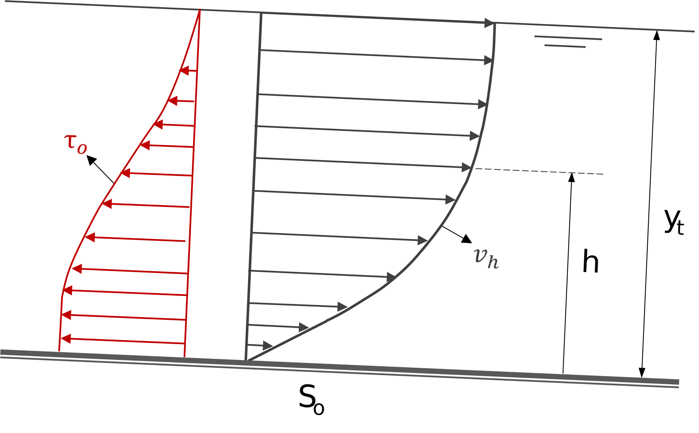
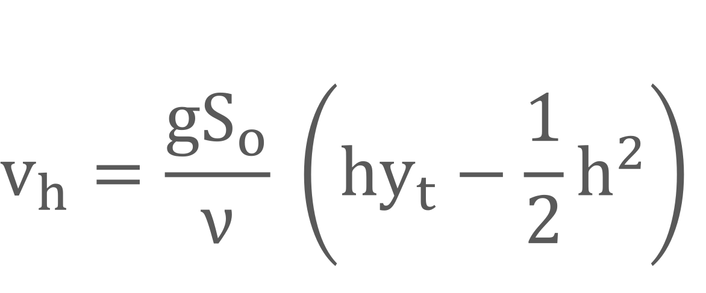
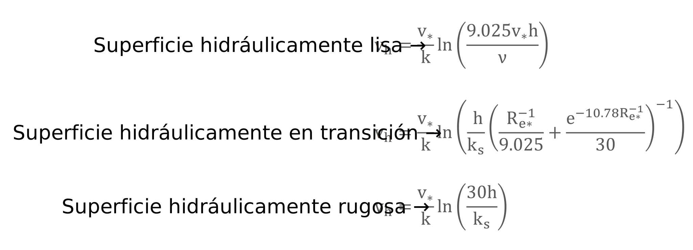

## Distribución de velocidades 

Keywords: `Hydraulics` `Open channel flow` `Velocity distribution` `Average velocity` `Discharge`

> Arroyo Las Ánimas, Cesar, Col. _Fuente propia_

En dinámica de fluidos, la velocidad **'V'** es una función vectorial del flujo, que depende del espacio y el tiempo _(en el caso de flujo no permanente)_. En el caso de los sistemas a presión, la distribución o perfil de velocidades en una sección transversal es axi-simétrico _(simétrico con respecto al eje)_, mientras que en sistemas a superficie libre no se presenta un perfil simétrico por las condiciones de frontera. 

 
Diferencia entre perfil de velocidades del flujo en sistemas a presión y flujo a superficie libre. 

 

 Particularmente, en la sección transversal de un canal a superficie libre, la velocidad del flujo se aproxima a cero en el fondo y en las paredes laterales del canal debido a la condición de **no deslizamiento**. Así mismo, la velocidad **máxima** ocurre cerca a la superficie libre, sin embargo, su localización depende más de la geometría de la sección transversal. 

La distribución de velocidades en una sección transversal depende también de otros factores, como una forma inusual de la sección, la rugosidad del canal y la presencia de curvas. Por ejemplo, en una corriente ancha, rápida y poco profunda o en un canal muy liso, la velocidad máxima por lo general se encuentra en la superficie libre. En el caso del material, entre mayor es el coeficiente de rugosidad del canal, mayor será la curvatura del perfil de velocidades.

 
Distribución típica de velocidad (con isotacas) en diferentes secciones transversales de un canal abierto.^[1]. 

 

La velocidad también puede cambiar en la dirección del flujo, como es el caso de los flujos variados, cuya profundidad de flujo cambia en el espacio, por lo que se dice que la distribución de la velocidad de flujo es en general tridimensional.

### Función del perfil de velocidades

  
Esquema del perfil de velocidades y esfuerzos de corte en un flujo a superficie libre.  

 

Como ya se definió, el flujo puede encontrarse en estado laminar, en transición o turbulento, siendo esta última la condición más común en el flujo a superficie libre. Para el caso de los sistemas en condición de flujo **laminar**, el perfil de velocidades puede expresarse como una función parabólica. Por ejemplo, para un canal ancho _(cuya relación ancho-profundidad sea considerable)_, la función se aproxima a la siguiente expresión. 

 
Donde, <b>So</b> corresponde a la pendiente del canal, <b>ν</b> es la viscosidad del líquido, <b>g</b> la constante gravitacional,  <b>yt</b> es la profundidad (total) de flujo y <b>h</b> corresponde a la variable de altura medida desde el fondo. 

 

En el caso de flujo en transición y **turbulento**, según la teoría de longitud de mezcla de Prandtl-Karman, el canal o conducto se puede considerar como hidráulicamente liso, hidráulicamente en transición o hidráulicamente rugoso dependiendo de sus propiedades, en especial de la rugosidad de la superficie y la viscosidad del fluido. La clasificación se realiza con el número de Reynolds asociado a la rugosidad de la superficie **Re***, definido por *Nikuradse* como el producto de la velocidad de corte **V*** y la rugosidad absoluta **ks** dividido por la viscosidad cinemática del fluido **ν**. 

Así mismo, el perfil de velocidades **'v = f(h)'**, se aproxima a una función logarítmica definida por las siguientes funciones.  

 
Donde, <b>v*</b> corresponde a la velocidad de corte, <b>k</b> es la constante Prandtl-Karman igual a 0.4,  <b>ks</b> es la rugosidad absoluta de la superficie,<b>Re*</b> es el número de Reynolds asociado a la rugosidad   y <b>h</b> corresponde a la variable de altura medida desde el fondo y perpendicular a este. 

 

### Caudal y velocidad media de flujo

En la práctica de la ingeniería, al trabajar con las ecuaciones fundamentales de la mecánica de fluidos, se plantea la hipótesis de un **fluido ideal** al usar la velocidad en términos de la **velocidad media** en las secciones transversales del canal. Teniendo en cuenta que esta velocidad media puede cambiar solamente en la dirección del flujo. Esta hipótesis de unidimensionalidad hace posible resolver problemas importantes de la vida real de manera simple, precisa y aplicada comúnmente en la práctica. 

### Ejemplo 1 - Perfil de velocidades en un canal trapezoidal
Determinar el perfil de velocidades para un canal trapezoidal revestido en concreto, que transporta un caudal de 1 metro cúbico por segundo. El canal tiene un ancho en la base de 0.5 metros y una inclinación de talud (1:z) de 1:0.25. La profundidad de flujo es de 2 metros. 

### Ejemplo 2 - Estimación de caudal de un canal natural
___
### Preguntas
1. ¿Qué es la hipótesis de fluido ideal?
___

### Referencias
- The Hydraulics of Channel Flow: An Introduction. Chanson H. 2nd Ed.,Elsevier Butterworth-Heinemann. 2004.
- Open Channel Hydraulics. Chow, Ven Te. 2nd Ed., Blackburn Press. 2009.
- Open Channel Flow. Chaudry, M. H. 2ed., Springer, 2008.
- Open Channel Flow. Osman Akan, A. Elsevier Ltd., 2006.
- Introducción a la hidráulica de canales. Duarte A. Carlos A. 4a Ed., Editorial Universidad Nacional de Colombia. 2016.
- Flow in open channels. Subramanya K. 3th Ed., Tata McGraw-Hill Publishing. 2009.

### Control de versiones

| Versión | Descripción                                                    |                    Autor                    | Horas |
|:-------:|:---------------------------------------------------------------|:-------------------------------------------:|:-----:|
| 2023.06 | Versión inicial, definición de estructura general y contenido. | [juanrodace](https://github.com/juanrodace) |  1.0  |
| 2023.06 | Inclusión de conceptos y esquemas.                             | [juanrodace](https://github.com/juanrodace) |  3.0  |

| [:arrow_backward:Anterior](Clasificacion.md) | [:house: Inicio](../../Readme.md) | [:beginner: Ayuda](https://github.com/juanrodace/J.HSLB/discussions) | [Siguiente:arrow_forward:](Presiones.md) |
|----------------------------------------------|-----------------------------------|----------------------------------------------------------------------|------------------------------------------|

_J.HSLB es de uso libre para fines académicos, conoce nuestra licencia, cláusulas, condiciones de uso y como referenciar los contenidos publicados en este repositorio, dando [clic aquí](../../License.md)._

_¡Encontraste útil este repositorio!, apoya su difusión marcando este repositorio con una ⭐ o síguenos dando clic en el botón Follow de [juanrodace](https://github.com/juanrodace) en GitHub._

[^1]: Introduction to Fluid Mechanics. Fox and McDonald's. 8th Ed., Jhon Wilwy & Sons, Inc. 2011.