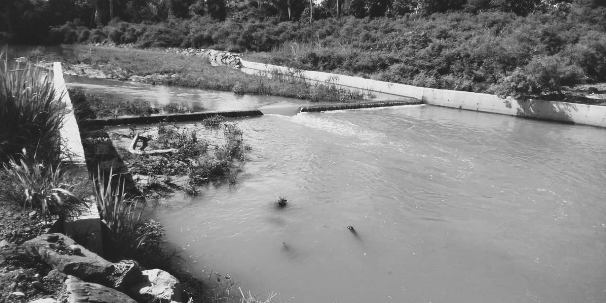
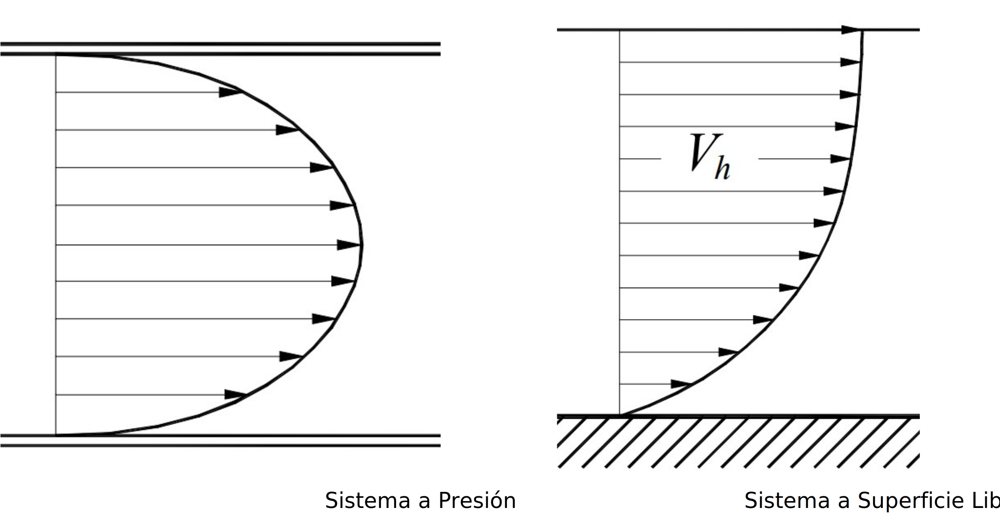
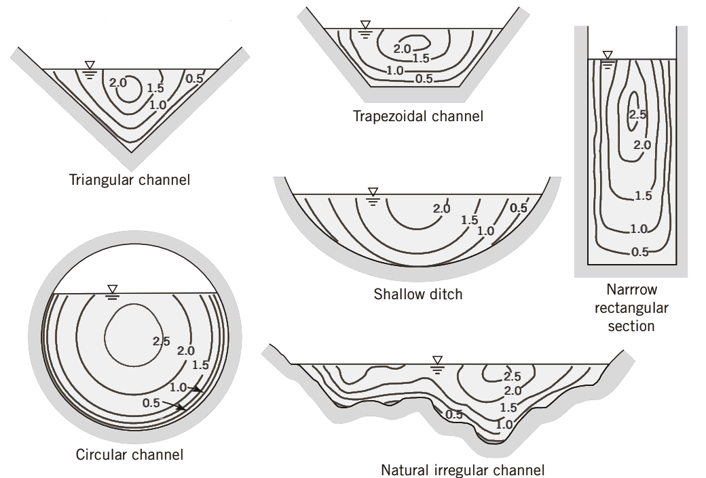

## Distribución de velocidades 

Keywords: `Hydraulics` `Open channel flow` `Uniform flow` `FGV` `FEV`

> Arroyo Las Ánimas, Cesar, Col. _Fuente propia_

En dinámica de fluidos, la velocidad **'V'** es una función vectorial del flujo, que depende del espacio y el tiempo _(en el caso de flujo no permanente)_. En el caso de los sistemas a presión, la distribución o perfil de velocidades en una sección transversal es axi-simétrico _(simétrico con respecto al eje)_, mientras que en sistemas a superficie libre no se presenta un perfil simétrico por las condiciones de frontera. 

 
Diferencia entre perfil de velocidades del flujo en sistemas a presión y flujo a superficie libre. 

 

 Particularmente, en la sección transversal de un canal a superficie libre, la velocidad del flujo se aproxima a cero en el fondo y en las paredes laterales del canal debido a la condición de **no deslizamiento**. Así mismo, la velocidad **máxima** ocurre cerca a la superficie libre, sin embargo, su localización depende más de la geometría de la sección transversal. 

La distribución de velocidades en una sección transversal depende también de otros factores, como una forma inusual de la sección, la rugosidad del canal y la presencia de curvas. Por ejemplo, en una corriente ancha, rápida y poco profunda o en un canal muy liso, la velocidad máxima por lo general se encuentra en la superficie libre. En el caso del material, entre mayor es el coeficiente de rugosidad del canal, mayor será la curvatura del perfil de velocidades.

 
Distribución típica de velocidad en secciones de canal abierto.^[1]. 

 

La velocidad también puede cambiar en la dirección del flujo, como es el caso de los flujos variados, cuya profundidad de flujo cambia en el espacio, por lo que se dice que la distribución de la velocidad de flujo es en general tridimensional.

### Función del perfil de velocidades

### Velocidad media de flujo

En la práctica de la ingeniería, al trabajar con las ecuaciones fundamentales de la mecánica de fluidos, se plantea la hipótesis de un fluido ideal al usar la velocidad en términos de la **velocidad media** en las secciones transversales del canal. Teniendo en cuenta que esta velocidad media puede cambiar solamente en la dirección del flujo. Esta hipótesis de unidimensionalidad hace posible resolver problemas importantes de la vida real de manera simple, precisa y aplicada comúnmente en la práctica. 

___

### Referencias
- The Hydraulics of Channel Flow: An Introduction. Chanson H. 2nd Ed.,Elsevier Butterworth-Heinemann. 2004.
- Open Channel Hydraulics. Chow, Ven Te. 2nd Ed., Blackburn Press. 2009.
- Open Channel Flow. Chaudry, M. H. 2ed., Springer, 2008.
- Open Channel Flow. Osman Akan, A. Elsevier Ltd., 2006.
- Introducción a la hidráulica de canales. Duarte A. Carlos A. 4a Ed., Editorial Universidad Nacional de Colombia. 2016.
- Flow in open channels. Subramanya K. 3th Ed., Tata McGraw-Hill Publishing. 2009.

### Control de versiones

| Versión | Descripción                                                    |                    Autor                    | Horas |
|:-------:|:---------------------------------------------------------------|:-------------------------------------------:|:-----:|
| 2023.06 | Versión inicial, definición de estructura general y contenido. | [juanrodace](https://github.com/juanrodace) |  1.0  |
| 2023.06 | Inclusión de conceptos y esquemas.                             | [juanrodace](https://github.com/juanrodace) |  1.0  |

| [:arrow_backward:Anterior](Clasificacion.md) | [:house: Inicio](../../Readme.md) | [:beginner: Ayuda](https://github.com/juanrodace/J.HSLB/discussions) | [Siguiente:arrow_forward:](Presiones.md) |
|----------------------------------------------|-----------------------------------|----------------------------------------------------------------------|------------------------------------------|

_J.HSLB es de uso libre para fines académicos, conoce nuestra licencia, cláusulas, condiciones de uso y como referenciar los contenidos publicados en este repositorio, dando [clic aquí](../../License.md)._

_¡Encontraste útil este repositorio!, apoya su difusión marcando este repositorio con una ⭐ o síguenos dando clic en el botón Follow de [juanrodace](https://github.com/juanrodace) en GitHub._

[^1]: Introduction to Fluid Mechanics. Fox and McDonald's. 8th Ed., Jhon Wilwy & Sons, Inc. 2011.