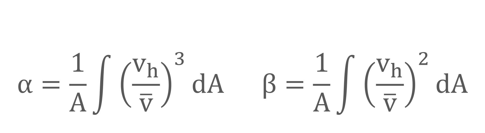
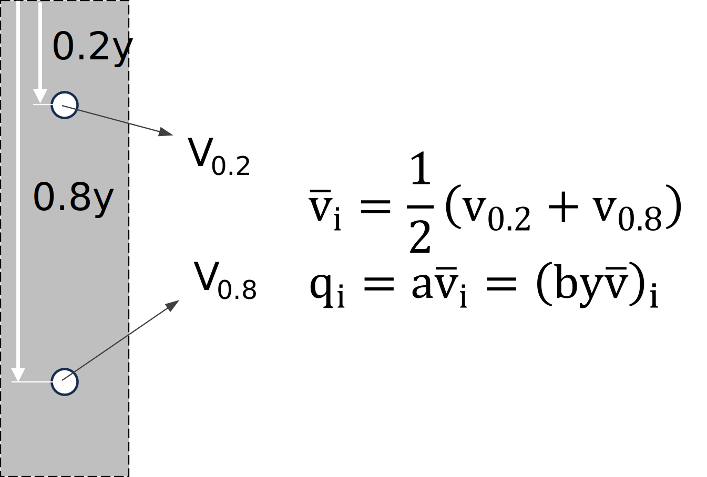

## Distribución de velocidades 

Keywords: `Hydraulics` `Open channel flow` `Velocity distribution` `Average velocity` `Discharge`

> Arroyo Las Ánimas, Cesar, Col. _Fuente propia_

En dinámica de fluidos, la velocidad **'V'** es una función vectorial del flujo, que depende del espacio y el tiempo _(en el caso de flujo no permanente)_. En el caso de los sistemas a presión, la distribución o perfil de velocidades en una sección transversal es axi-simétrico _(simétrico con respecto al eje)_, mientras que en sistemas a superficie libre no se presenta un perfil simétrico por las condiciones de frontera. 

 
Diferencia entre perfil de velocidades del flujo en sistemas a presión y flujo a superficie libre.  

 

 Particularmente, en la sección transversal de un canal a superficie libre, la velocidad del flujo se aproxima a cero en el fondo y en las paredes laterales del canal debido a la condición de **no deslizamiento**. Así mismo, la velocidad **máxima** ocurre cerca a la superficie libre, sin embargo, su localización depende más de la geometría de la sección transversal. 

La distribución de velocidades en una sección transversal depende también de otros factores, como una forma inusual de la sección, la rugosidad del canal y la presencia de curvas. Por ejemplo, en una corriente ancha, rápida y poco profunda o en un canal muy liso, la velocidad máxima por lo general se encuentra en la superficie libre. En el caso del material, entre mayor es el coeficiente de rugosidad del canal, mayor será la curvatura del perfil de velocidades.

 
Distribución típica de velocidad (con isotacas) en diferentes secciones transversales de un canal abierto. <i>Tomado de Fox and McDonald's. 2011</i>.  

 

La velocidad también puede cambiar en la dirección del flujo, como es el caso de los flujos variados, cuya profundidad de flujo cambia en el espacio, por lo que se dice que la distribución de la velocidad de flujo es en general tridimensional.

### Función del perfil de velocidades

  
Esquema del perfil de velocidades y esfuerzos de corte en un flujo a superficie libre.  

 

Como ya se definió, el flujo puede encontrarse en estado laminar, en transición o turbulento, siendo esta última la condición más común en el flujo a superficie libre. Para el caso de los sistemas en condición de flujo **laminar**, el perfil de velocidades puede expresarse como una función parabólica. Por ejemplo, para un canal ancho _(cuya relación ancho-profundidad sea considerable)_, la función se aproxima a la siguiente expresión. 

 
Donde, <b>So</b> corresponde a la pendiente del canal, <b>ν</b> es la viscosidad del líquido, <b>g</b> la constante gravitacional,  <b>yt</b> es la profundidad (total) de flujo y <b>h</b> corresponde a la variable de altura medida desde el fondo.  

 

En el caso de flujo en transición y **turbulento**, según la teoría de longitud de mezcla de Prandtl-Karman, el canal o conducto se puede considerar como hidráulicamente liso, hidráulicamente en transición o hidráulicamente rugoso dependiendo de sus propiedades, en especial de la rugosidad de la superficie y la viscosidad del fluido. La clasificación se realiza con el número de Reynolds asociado a la rugosidad de la superficie <b>Re*</b>, definido por *Nikuradse* como el producto de la velocidad de corte **V*** y la rugosidad absoluta **ks** dividido por la viscosidad cinemática del fluido **ν**. 

Así mismo, el perfil de velocidades **'v = f(h)'**, se aproxima a una función logarítmica definida por las siguientes funciones.  

 
Donde, <b>v*</b> corresponde a la velocidad de corte, <b>k</b> es la constante Prandtl-Karman igual a 0.4,  <b>ks</b> es la rugosidad absoluta de la superficie,<b>Re*</b> es el número de Reynolds asociado a la rugosidad   y <b>h</b> corresponde a la variable de altura medida desde el fondo y perpendicular a este. 

 

### Velocidad media y caudal

En la práctica de la ingeniería, al trabajar con las ecuaciones fundamentales de la mecánica de fluidos, se plantea la hipótesis de un **fluido ideal** al usar la velocidad en términos de **velocidad media (Vm)** en las secciones transversales del canal. Teniendo en cuenta que esta velocidad media puede cambiar solamente en la dirección del flujo. Esta hipótesis de unidimensionalidad hace posible resolver problemas importantes de la vida real de manera simple, precisa y aplicada comúnmente en la práctica. 

  
Esquema de un perfil de velocidades y su 'cambio' a un perfil de velocidades (constante) de un fluido ideal.  

 

La **velocidad media** se puede expresar en función de la integral del perfil de velocidades y el área de la sección transversal. Sin embargo, es común definirla en función del **caudal** o flujo volumétrico **'Q'** y el área de flujo **A** como:

 

 

> Nota: Este supuesto unidimensional es aplicable a canales relativamente rectos y también a los canales de meandros con sinuosidades pequeñas y desbordamientos limitados. Sin embargo, la hipótesis unidimensional puede resultar insuficiente para canales de gran sinuosidad y/o flujos con grandes desbordamientos.

#### Coeficiente de Boussinesq y Coriolis

En la práctica, al plantear la hipótesis del fluido ideal y utilizar la velocidad media en las ecuaciones fundamentales de la mecánica de fluidos, es necesario aplicar factores o **coeficientes de corrección** a los términos que dependen de la velocidad. En el caso de la ecuación de conservación de la energía, aparece el coeficiente de **Coriolis** o coeficiente de energía (**α**). Para el caso de la ecuación de cantidad de movimiento o _momentum_ se ha definido el coeficiente de **Boussinesq** o coeficiente de la cantidad de movimiento (**ß**). 

 

 

> Las ecuaciones anteriores son bastante precisas para la estimación de los coeficientes, sin embargo, requieren de mediciones detalladas de la distribución de velocidades en una sección transversal. Alternativamente, cuando únicamente se conocen la velocidad media **Vm**  y la velocidad máxima **Vmax** , pueden utilizarse fórmulas para calcular valores aproximados de los coeficientes de Coriolis y Boussinesq.

Algunos valores típicos de los coeficientes de corrección para algunas geometrías, se presentan en la siguiente tabla.

|                  Canal                  | α | ß |
|:---------------------------------------:|:-:|:-:|
| Muy ancho con relación $\frac{y}{b}>10$ |   |   |
|                                         |   |   |
|                                         |   |   |

 

### Medición de velocidad y flujo

La medición de flujos y velocidades en los canales es muy utilizada para la realización de aforos, caracterización del flujo y/o establecer una sección de control. Tradicionalmente, se realizan mediciones de velocidad con ayuda de medidores de corriente (correntómetros), sin embargo, han aparecido nuevas tecnologías de aforo con sistemas electrónicos.

En el caso de los correntómetros, se mide la velocidad de flujo mediante el conteo del número de revoluciones por segundo del rotor y su relación con una curva o tabla de calibración. La rotación puede ser alrededor de un eje horizontal o de un eje vertical.

En el procedimiento típico, se hacen varios sondeos de profundidad, por lo general de 20 a 30, dependiendo del tamaño de la sección transversal. Cada sondeo está asociado a una sección parcial del flujo. La sección parcial es un rectángulo o trapecio y de ancho igual a la mitad de la distancia entre las dos verticales adyacentes. 

  
Esquema de una sección transversal con subsecciones rectangulares para medición de velocidades y flujo.  

 

Comúnmente se usa el método de **dos puntos**, donde el correntómetro se coloca a 0.2 y 0.8 de la profundidad de flujo, medida a partir de la superficie del agua. Por otro lado, en el método de un solo punto, el correntómetro se coloca a 0.6 de la profundidad. El promedio de las velocidades a las profundidades de 0.2 y 0.8, o la velocidad a la profundidad de 0.6 se toma como la velocidad media de la **subsección**. Ahora para cada subsección se calcula el flujo o descarga como el producto entre su velocidad media y su área. **$q_{i}=\bar{v}a_{i}$**. Finalmente, el flujo o descarga total **Q** es la suma de los flujos **qi** de todas las secciones parciales. Así mismo, la velocidad media de toda la sección, será podrá estimar como al cociente entre el caudal **'Q'** y el área total de la sección **'A'**.

  
Estimación de velocidad media y caudal de cada subsección aforada.  

 

> <u>Nota</u>: El método de un solo punto se recomienda cuando la medición de dos puntos es poco práctica, por ejemplo, en corrientes muy poco profundas.

### Ejemplo 1 - Perfil de velocidades en un canal trapezoidal. (Clic para ver en: )
Determinar el perfil de velocidades para un canal trapezoidal revestido en concreto, que transporta un caudal de 1 metro cúbico por segundo. El canal tiene un ancho en la base de 0.5 metros y una inclinación de talud (1:z) de 1:0.25. La profundidad de flujo es de 2 metros. Asuma una densidad de 998 $\frac{kg}{m^{3}}$, una viscosidad de 1.1 $e^{-6} \frac{m^{2}}{s}$, una rugosidad de la superficie ks de 0.36mm y un coeficiente de Manning de 0.013.

  
Esquema del canal con sección trapezoidal.  

 

1. Lo primero a realizar, es clasificar el flujo de acuerdo con Prandlt-Karman como superficie hidráulicamente lisa, en transición o turbulenta. Para esto se estima la velocidad de corte **V*** y el número de Reynolds asociado a la rugosidad de la superficie <b>Re*</b>.

$$\bar{v}=\frac{Q}{A}=\frac{Q}{by+zy^{2}}=\frac{1}{(0.5)(2)+(0.25)(2)^{2}}=0.5\frac{m}{s}$$

$$V_{*}=\bar{v}\frac{ng^{1/2}}{R^{1/6}}=0.5\frac{(0.013)g^{1/2}}{(2/4.6)^{1/6}}=0.023\frac{m}{s}$$

$$R_{e*}=\frac{V_{*}k_{s}}{\nu}=\frac{(0.023)(0.36e^{-3})}{1.1e^{-6}}=7.66$$

2. Conociendo la clasificación realizada, en este caso como superficie hidráulicamente en **transición**. Se estima y grafica el perfil de velocidades, como se muestra a continuación.

  
Esquema del canal con sección trapezoidal. 

 

### Ejemplo 2 - Estimación de caudal de un canal natural (Clic para ver en: )

Estimar el caudal y velocidad media de flujo de una sección transversal a la cual se le realizó un aforo del flujo con ayuda de un medidor de velocidad por medio del método de dos puntos. Los datos de velocidad registrados se presentan en la siguiente tabla y los puntos de aforo se pueden identificar en el esquema.

   

 

A partir de los datos de la medición y de acuerdo con el método de los dos puntos, para cada subsección de aforo, se estima la velocidad media **Vm(i)**, el área **ai** y el flujo **qi**.

   

 

Finalmente, se estima el caudal total **QT**, el área total **AT** y la velocidad media de toda la sección **Vm**.

$$Q_{T}=\sum q_{i}=300.1\frac{m^{3}}{s}$$
$$A_{T}=\sum a_{i}=325.6m^{2}$$
$$\bar{V}=\frac{Q_{T}}{A_{T}}=0.92\frac{m}{s}$$

___
### Preguntas
1. ¿Qué es la hipótesis de fluido ideal?
2. ¿Qué es una sección de control?
2. Determine y grafique el perfil de velocidades de un canal muy ancho (b=600m) con una profundidad media de y=10m y un caudal de 5000 $\frac{m^{3}}{s}$. Considere una densidad relativa de 1.05, una viscosidad de 1.15e-6 $\frac{m^{2}}{s}$ y una rugosidad absoluta del fondo de 14mm y un coeficiente de Manning n=0.04.
3. Estime los coeficientes de Coriolis y Boussinesq para el flujo presentado en el ejemplo 2.
___

### Referencias
- The Hydraulics of Channel Flow: An Introduction. Chanson H. 2nd Ed.,Elsevier Butterworth-Heinemann. 2004.
- Open Channel Hydraulics. Chow, Ven Te. 2nd Ed., Blackburn Press. 2009.
- Open Channel Flow. Chaudry, M. H. 2ed., Springer, 2008.
- Open Channel Flow. Osman Akan, A. Elsevier Ltd., 2006.
- Introducción a la hidráulica de canales. Duarte A. Carlos A. 4a Ed., Editorial Universidad Nacional de Colombia. 2016.
- Flow in open channels. Subramanya K. 3th Ed., Tata McGraw-Hill Publishing. 2009.

### Control de versiones

| Versión | Descripción                                                    |                    Autor                    | Horas |
|:-------:|:---------------------------------------------------------------|:-------------------------------------------:|:-----:|
| 2023.06 | Versión inicial, definición de estructura general y contenido. | [juanrodace](https://github.com/juanrodace) |  1.0  |
| 2023.06 | Inclusión de conceptos y esquemas.                             | [juanrodace](https://github.com/juanrodace) |  3.0  |

| [:arrow_backward:Anterior](Clasificacion.md) | [:house: Inicio](../../Readme.md) | [:beginner: Ayuda](https://github.com/juanrodace/J.HSLB/discussions) | [Siguiente:arrow_forward:](Presiones.md) |
|----------------------------------------------|-----------------------------------|----------------------------------------------------------------------|------------------------------------------|

_J.HSLB es de uso libre para fines académicos, conoce nuestra licencia, cláusulas, condiciones de uso y como referenciar los contenidos publicados en este repositorio, dando [clic aquí](../../License.md)._

_¡Encontraste útil este repositorio!, apoya su difusión marcando este repositorio con una ⭐ o síguenos dando clic en el botón Follow de [juanrodace](https://github.com/juanrodace) en GitHub._

[^1]: Introduction to Fluid Mechanics. Fox and McDonald's. 8th Ed., Jhon Wilwy & Sons, Inc. 2011.